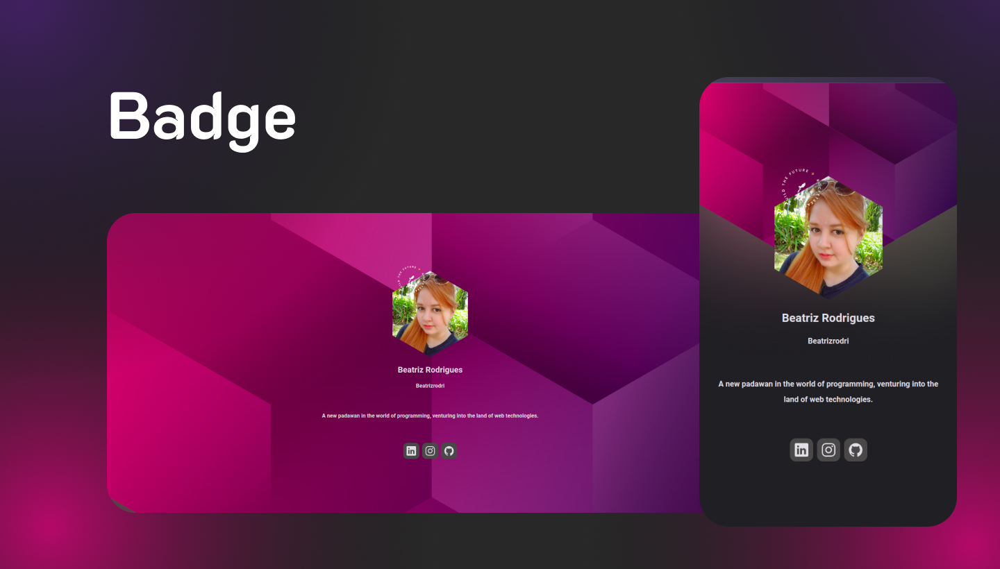

# Badge

Project made on a rocketseat NLW.

## Technologies used

This project was done using the following technologies

 **Javascript**

 **HTML**

 **CSS**

## Objective of project

In order to be a digital badge, it uses links from your social media and your github bio, thus serving as a brief presentation of who you are. It can be used in several ways. One of them is in the bios of your social networks so that other people have access to your other social networks and perhaps also as an additional presentation for your profile.

## What I learned from this project

It was my first project, so of course it was a huge help for my training. As it was my first real contact with programming, everything in this project had to be absorbed. Even though it is a small project, just like a house, the foundation is very important, in studies having a strong foundation is extremely important.
